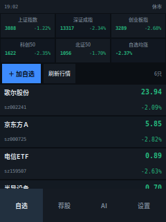

# stock-pi-mobile · 2.4寸触摸屏股票终端

定位：随身盯盘终端（代替手机）。只做界面，行情/预测/荐股/AI 全部复用
[stock-analyzer](https://github.com/Languangxun/stock-analyzer) 的
`stock_predict.py`（与 `stock_gui.py` 同源），不复制算法。

- 自适应 **240x320 竖屏 / 320x240 横屏**（自动检测；`--size` 可桌面预览）
- 触控优先：大按钮、拖动滚动、长按菜单、数字键盘；无鼠标也能全流程操作
- 屏幕尽头的导航：自选 / 荐股 / AI / 设置
- 后端缺失时降级：无网显示缓存/--；无 numpy 时荐股给出兜底入口



## 功能

| 屏 | 内容 |
|---|---|
| 自选 | 6 格指数条（5指数+自选均涨）、自选行情（30秒自动刷新）、加自选/长按置顶与删除 |
| 详情 | 迷你K线+MA20+T+1预测区间、建议/量能/大盘/板块/策略/信号/回测，完整分析、AI问、自选开关 |
| 荐股 | 稳健/均衡/激进三档切换、闸门状态、手数/金额/评分、AI选档；优先读 picks_cache.json 快照（小内存设备推荐），算力够时可本地重算 |
| AI | DeepSeek/OpenAI 兼容多轮问答，自动带大盘+自选+当前个股上下文，预设问题一键问 |
| 设置 | API Key/模型/接口、荐股资金/偏好/标的池/默认档、网络/WiFi、刷新代码表、补自选K线、清空会话、红涨绿跌 |
| WiFi | 当前 SSID/IP/信号、扫描列表点选连接、密码输入、一键连预设、断开、手动连接、设静态IP/恢复DHCP |

## 部署到树莓派

1. 把本仓库放到 Pi（`git clone` 或整体拷贝），再从
   [stock-analyzer](https://github.com/Languangxun/stock-analyzer) 取后端三件套
   放到同目录（或任意目录用 `--backend` 指定）：
   ```
   stock_predict.py      # 算法（唯一生成物，勿手改）
   stock_cache.db        # 日K缓存
   stock_gui.ini         # 可选：后端配置（API Key 等）
   ```
   > 如果从开发机拷 `stock_gui.ini`，记得清掉 `[proxy] url`（开发机代理
   > 在 Pi 上不存在，会导致行情全部失败，界面显示 `--`）。
2. 系统依赖：
   ```
   sudo apt install python3-tk fonts-wqy-zenhei
   sudo apt install python3-numpy        # 三档引擎（armv6 用 apt 版，别 pip 编译）
   ```
   armv6 小内存设备（Pi Zero 427MB）即使装了 numpy 也跑不动三档引擎
   （面板要 1GB+ 内存），用下面的「荐股快照」方案；其它功能不受影响。
3. 先自检：
   ```
   python3 mobile_gui.py --check
   ```
4. 运行（小屏自动全屏）：
   ```
   ./start_mobile.sh          # 循环守护 + 日志 /tmp/stock_mobile.log
   ```
   或直接 `python3 mobile_gui.py --fullscreen --nocursor`

### 开机自启（参考）

`~/.bash_profile`（tty1 自动起 X）：

```sh
if [ -z "$SSH_CLIENT" ] && [ "$(tty)" = "/dev/tty1" ]; then
  export FRAMEBUFFER=/dev/fb1
  while :; do startx -- -nocursor vt1; sleep 3; done
fi
```

`~/.config/openbox/autostart` 里追加：

```sh
/home/pi/stock_pi_mobile/start_mobile.sh &
```

### 文字输入

- 股票代码：数字键盘弹窗（含退格/确定）
- 文本输入（WiFi 密码/SSID、AI 模型、API Key 等）：输入框自带触摸键盘
  （数字 + 字母 + `.-_`，⇧ 大小写、空格、退格、清空、取消/保存）
- 也可接 USB 键盘，或在电脑上改好 `stock_mobile.ini` 再拷过去

## 桌面预览（开发用）

```sh
python3 mobile_gui.py --size 240x320          # 竖屏预览窗
python3 mobile_gui.py --size 320x240 --tab picks
python3 mobile_gui.py --screenshot /tmp/s.png --shot-delay 5000   # 截图后退出
```

## 荐股快照（小内存设备推荐）

Pi Zero/armv6 跑不动三档引擎，用「电脑算、终端看」：

```sh
# 电脑上（装了 numpy 的机器，数据库同目录）
python3 make_picks.py --backend ~/stock_predict
# 生成 picks_cache.json（三档全量），拷到终端 stock_pi_mobile/ 下
rsync -a picks_cache.json pi@<树莓派IP>:~/stock_pi_mobile/
```

终端打开「荐股」会直接秒读快照，右上角标注 `快照 时间 · topN`；
点档位切换即时显示；点【刷新】重新读快照文件（rsync 后无需重启）。
本机算力足够时（内存 ≥450MB 且有 numpy），长按/强制刷新可直接本地重算。

## WiFi / 网络（树莓派）

基于 `nmcli`（NetworkManager，Raspberry Pi OS Bookworm / Ubuntu 默认自带）。
设置 → 网络 → WiFi 进入：

- **扫描**：列出附近网络（信号/加密/已保存/预设标记），点选即连；加密网络弹密码，
  已保存过的网络点一下就自动重连
- **一键连预设**：连接 `stock_mobile.ini [wifi]` 里预设的 ssid/password（默认空，
  在设置里点【预设】行可改，或在 WiFi 页手动连一次后把参数填进 ini）
- **手动连接**：输入 SSID + 密码（适合隐藏网络）
- **设静态IP / 恢复DHCP**：对当前连接的 WiFi 生效；应用时网络会短暂中断
- 启动时若未连网且预设 SSID 在扫描列表里，会自动连接一次（`--no-wifi-auto` 关闭）

配置示例（`stock_mobile.ini`，默认留空）：

```ini
[wifi]
ssid =
password =
static_ip =
gateway =
```

> 注意：WiFi 密码以明文存在 `stock_mobile.ini`，请勿把该文件分享出去。
> SSID 大小写不一致时（如 `lan` / `LAN`）连接会自动按扫描结果纠正。
> WPA/WPA2 密码至少 8 位；少于 8 位 nmcli 会拒绝。

## 配置

首次运行自动生成 `stock_mobile.ini`（自选/键值/AI 参数/荐股参数/WiFi）。
自选默认从后端 `stock_gui.ini [watchlist]` 继承。

后端查找顺序：`--backend DIR` > 环境变量 `STOCK_BACKEND` > 本目录 >
`~/stock_predict` > `~/ai-quant/scripts/cli`；也可在 `stock_mobile.ini`
`[backend] dir` 固定。

## 注意

- 荐股价格/手数沿用三档引擎口径（乘法前复权），与桌面客户端一致。
- 数据源依赖腾讯/东财等公开接口；盘中需联网，盘后看缓存。
- 仅统计参考，不构成投资建议。
